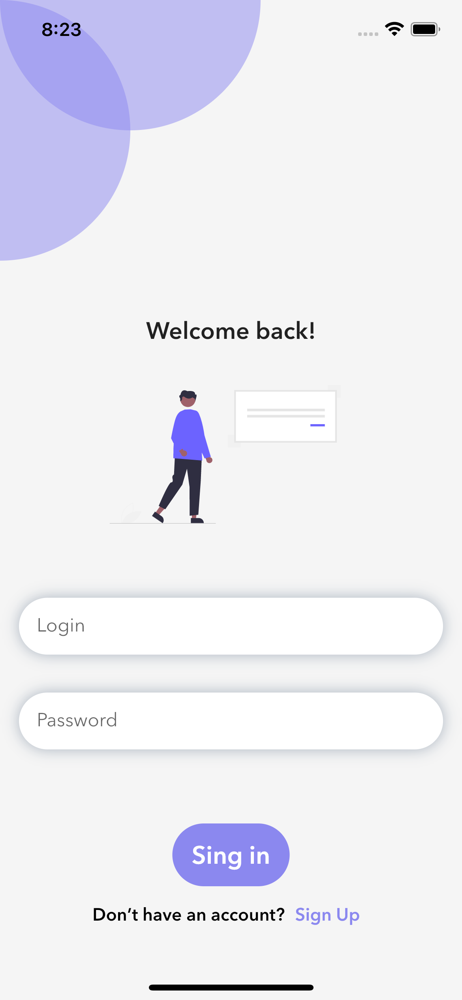
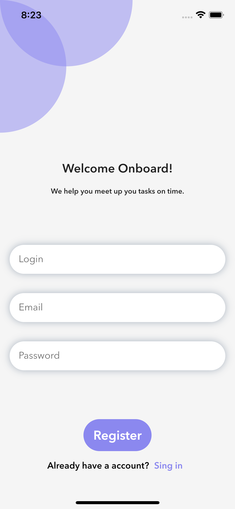
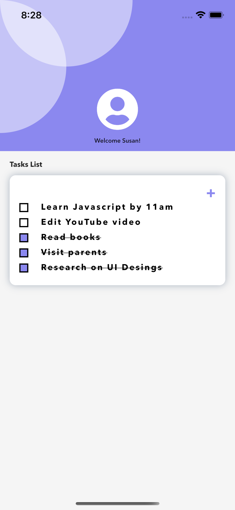

# todo-app

## About
This is an application for storing things to do. It is used for saving your tasks and unchecking the ones already done.

## Why?
The application was implemented to improve skills in Flutter.

## Used library
- retrofit
- get
- hive
- rxdart
- font awesome
- provider

## Authors
- Szymon Gęsicki

## Screenshots

  

